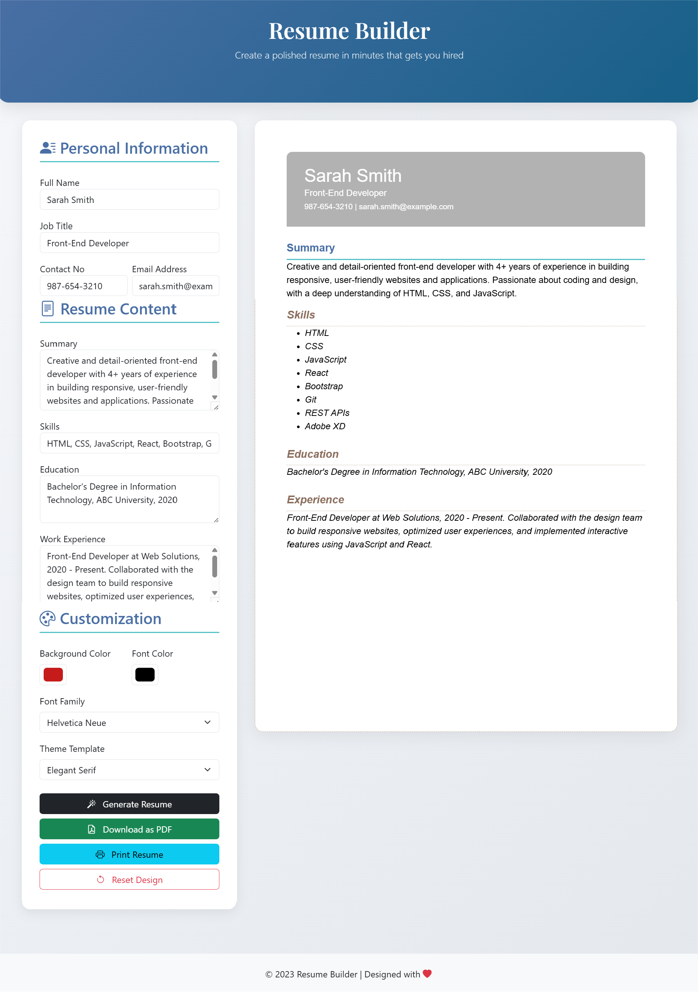
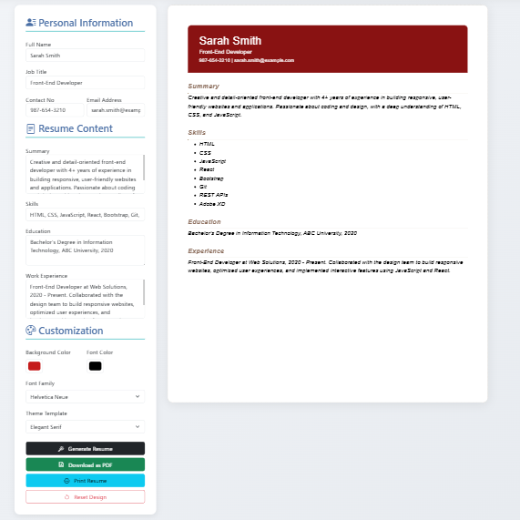
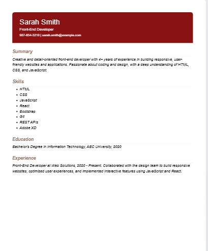

# Resume-Builder
Resume Builder is a web-based application that allows users to create, customize, and download professional resumes effortlessly. With a user-friendly interface, multiple design templates, and real-time preview functionality, this tool helps job seekers craft polished resumes in minutes. 

## 🎥 Video Demo

<div align="center">
  <a href="https://youtu.be/tHHHMjIkmVg">
    
  </a>
  <p>Click the image to watch the tutorial</p>
</div>


## 🖼️ Screenshots
<div align="center">
  
</div>

<div align="center">
  
  
</div>


## ✨ Features  

- **12+ Professional Templates** (Classic, Modern, Dark, Tech, Creative etc.)  
- **Customization**:  
  - Change colors, fonts, and layouts  
  - Adjust background and text colors  
- **Real-time Preview**: See changes instantly  
- **One-Click Export**: Download as PDF  
- **Print Directly**: Browser print functionality  
- **Mobile-Friendly**: Works on all devices  

## 🛠️ Technologies  

- **Frontend**: HTML5, CSS3, JavaScript  
- **UI Framework**: Bootstrap 5  
- **PDF Generation**: jsPDF + html2canvas  
- **Icons**: Bootstrap Icons  
- **Fonts**: Google Fonts  

## 🚀 How to Use  

1. **Fill** your details (name, skills, experience etc.)  
2. **Customize** colors, fonts, and theme  
3. **Preview** your resume in real-time  
4. **Download** as PDF or print directly
graph TD
    A[Fill Form] --> B[Customize Design]
    B --> C[Generate Resume]
    C --> D[Download PDF]

### Installation (Local Run)  

```bash
git clone https://github.com/malaikazehra/resume-builder.git
cd resume-builder  
# Open index.html in browser  
